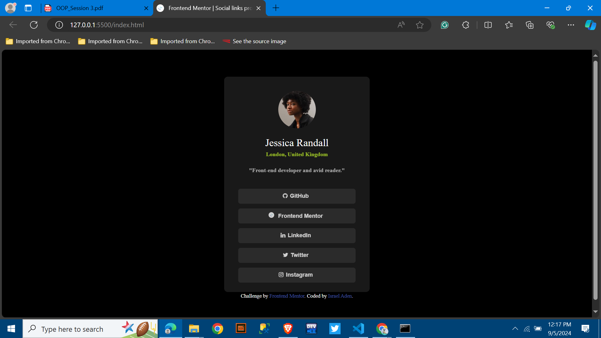

# Frontend Mentor - Social links profile solution

This is a solution to the [Social links profile challenge on Frontend Mentor](https://www.frontendmentor.io/challenges/social-links-profile-UG32l9m6dQ). Frontend Mentor challenges help you improve your coding skills by building realistic projects. 

## Table of contents

  - [Overview](#overview)
  - [The challenge](#the-challenge)
  - [Screenshot](#screenshot)
  - [Links](#links)
  - [Built with](#built-with)
  - [What I learned](#what-i-learned)
  - [Continued development](#continued-development)
  - [Author](#author)
  - [Acknowledgments](#acknowledgments)

## Overview
A Social Link Page

### The challenge

Users should be able to:

- See hover and focus states for all interactive elements on the page

### Screenshot

### Links

- Solution URL: (https://github.com/Is-Ra-El/FM-002)
- Live Site URL: (https://is-ra-el.github.io/FM-002/)

### Built with

- Semantic HTML5 markup
- CSS custom properties

### What I learned
learned how to add social icons through (<link rel="stylesheet" href="https://cdnjs.cloudflare.com/ajax/libs/font-awesome/4.7.0/css/font-awesome.min.css">),
and how to be more creative in styling.

### Continued development
Areas i need work on is styling and tactical page building.
### Useful resources

## Author

- Author - Israel Aden
- Frontend Mentor - [@yourusername](https://www.frontendmentor.io/profile/Is-Ra-El)

## Acknowledgments

Hat tip to google and w3schools